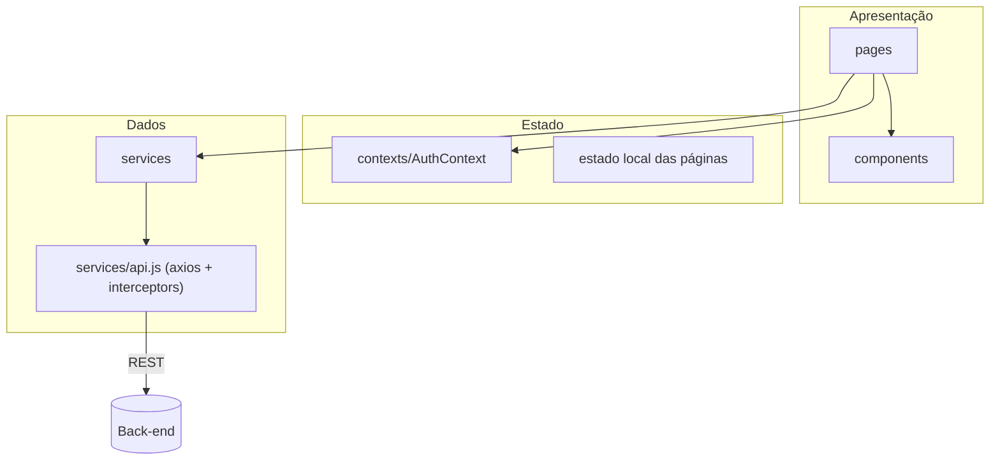
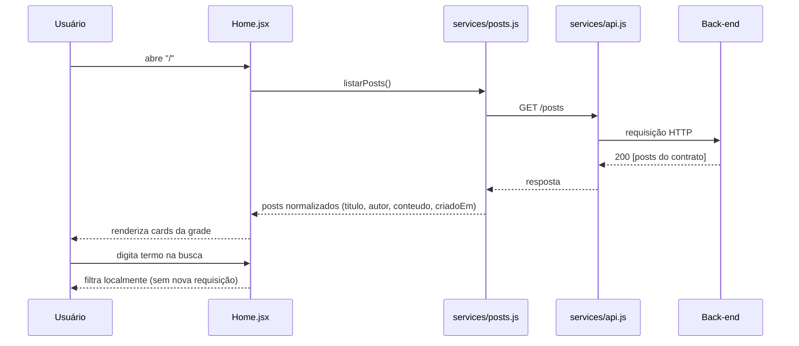
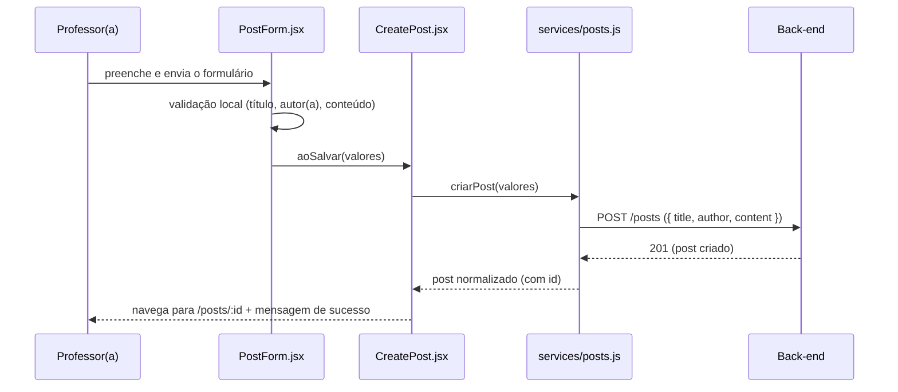
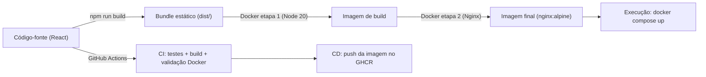

# Arquitetura da aplicação

Documento técnico do front-end do Blog Acadêmico (Tech Challenge). Descreve a visão geral, as camadas, os fluxos principais, o gerenciamento de estado, a integração com o back-end e as decisões arquiteturais.

---

## 1. Visão geral

O front-end é uma **SPA (Single Page Application)** em React que consome a API REST de blogging do back-end Node.js. Não há renderização no servidor: o bundle estático é servido pelo Vite (desenvolvimento) ou pelo Nginx (Docker/produção), e a navegação é feita no navegador com React Router.

```mermaid
flowchart LR
    U[Professores(as) e Estudantes] -->|navegador| FE["Front-end React (Vite + styled-components)"]
    FE -->|"HTTP/JSON — REST"| BE["Back-end Node.js — API de blogging"]
    FE -.->|"desenvolvimento/demonstração"| MK["API simulada (mock/server.js)"]
```

Requisitos cobertos: lista com busca, leitura com comentários, criação, edição, administração e autenticação de professores(as) com rotas protegidas — além de responsividade, acessibilidade e integração REST.

## 2. Camadas e organização do código



| Camada | Pasta | Responsabilidade |
| --- | --- | --- |
| Páginas | `src/pages` | Uma página por rota; orquestram carregamento, erro e sucesso. |
| Componentes | `src/components` | Reutilizáveis e sem regra de negócio (formulário de post, seção de comentários, navbar, etc.). |
| Estado global | `src/contexts` | Somente a sessão do usuário (`AuthContext`). |
| Hooks | `src/hooks` | `useAuth` (acesso à sessão) e `useDocumentTitle` (título da aba). |
| Serviços | `src/services` | Comunicação com a API: instância axios, endpoints, normalização de payloads e mensagens de erro. |
| Estilos | `src/styles` | Tema (cores/tipografia), estilos globais e mixins de media query. |
| Utilitários | `src/utils` | Funções puras de texto (busca/resumo) e data, cobertas por testes. |

## 3. Fluxos principais

### 3.1 Listagem com busca



A busca é feita no cliente (`filtrarPosts`), comparando o termo com título, autor(a) e conteúdo, ignorando acentos e diferenças de maiúsculas. A decisão mantém a aplicação funcional mesmo que o back-end não implemente busca por query param.

### 3.2 Autenticação

```mermaid
sequenceDiagram
    participant U as Professor(a)
    participant L as Login.jsx
    participant AC as AuthContext
    participant A as services/api.js
    participant B as Back-end
    U->>L: envia e-mail e senha
    L->>AC: entrar({ email, password })
    AC->>A: POST /auth/login
    A->>B: requisição HTTP
    B-->>A: 200 { token, user }
    A-->>AC: resposta
    AC->>AC: salva sessão no localStorage
    AC-->>L: sessão ativa (usuario, estaAutenticado)
    L-->>U: redireciona ao destino original (ex.: /admin)
    Note over A,B: requisições seguintes enviam Authorization: Bearer &lt;token&gt;
```

- Um interceptor de requisição anexa o token automaticamente.
- Um interceptor de resposta detecta `401` e dispara o evento `auth:expired`; o `AuthContext` escuta, limpa a sessão e a interface volta ao estado deslogado.
- O `ProtectedRoute` redireciona visitantes sem sessão para `/login`, guardando o destino original no `state` da navegação.

### 3.3 Criação de post



O mesmo componente `PostForm` é reaproveitado na edição (`PUT /posts/:id`), mudando apenas `valoresIniciais`, rótulos e o comportamento pós-salvamento.

## 4. Gerenciamento de estado

| Escopo | Ferramenta | Conteúdo |
| --- | --- | --- |
| Sessão | Context API (`AuthContext`) | `usuario`, `token`, `estaAutenticado`, `entrar()`, `sair()` |
| Páginas | `useState`/`useEffect` locais | listas, carregamento, erros, formulários |
| Derivados | `useMemo` | resultado da busca (filtra `posts` por termo) |

Optou-se por **Context API** porque o único estado global real é a sessão; Redux adicionaria complexidade sem benefício para o escopo. Cada página carrega seus próprios dados e trata seus estados de `carregando`/`erro` — padrão simples e suficiente para a aplicação.

## 5. Integração com o back-end

- **Instância única do axios** (`services/api.js`) com `baseURL` vinda de `VITE_API_URL` e timeout de 15s.
- **Interceptors**: anexa o token `Bearer`; trata `401` globalmente.
- **Normalização**: `normalizarPost`/`normalizarComentario` convertem o contrato (inglês) para o modelo interno (pt-BR) e toleram variações comuns (`titulo`, `conteudo`, `_id`, respostas embrulhadas etc.).
- **Erros**: a função `mensagemDeErro` traduz falhas de rede e códigos HTTP em mensagens amigáveis para a interface; erros de back-end (`message`/`mensagem`/`erro`) têm prioridade.
- **Ajuste de contrato**: se o back-end divergir do contrato documentado no README, o ajuste é feito somente em `src/services/`.

## 6. Roteamento e proteção de rotas

| Rota | Componente | Acesso |
| --- | --- | --- |
| `/` | `Home` | Público |
| `/posts/:id` | `PostDetail` | Público |
| `/login` | `Login` | Público (redireciona se já autenticado) |
| `/posts/novo` | `CreatePost` | Protegido |
| `/posts/:id/editar` | `EditPost` | Protegido |
| `/admin` | `Admin` | Protegido |
| `*` | `NotFound` | Público |

O `ProtectedRoute` envolve as rotas privadas: sem sessão, retorna `<Navigate to="/login" state={{ destino }} />`. Após o login, a página `Login` redireciona (de forma declarativa) para o `destino` salvo, exibindo a mensagem de sucesso.

## 7. Estilização e responsividade

- **styled-components** com `ThemeProvider`: cores, tipografia, raios e sombras centralizados em `src/styles/theme.js`.
- **Mobile first**: componentes com estilos base para telas pequenas e refinamentos progressivos via `media.sm/md/lg` (`src/styles/mixins.js`).
- **Tabela administrativa** esconde colunas no mobile e mantém as ações acessíveis; a navbar colapsa em menu hambúrguer abaixo de 768px.

## 8. Acessibilidade

Práticas adotadas:

1. Estrutura semântica e landmarks (`header`, `nav`, `main`, `footer`).
2. Formulários com `label` explícito; erros ligados por `aria-describedby` e sinalizados com `aria-invalid`; feedback em `role="alert"`.
3. Estados de carregamento anunciados com `role="status"`.
4. Menu mobile que expõe `aria-expanded`/`aria-controls` e rótulo do botão atualizado ao abrir/fechar.
5. Foco visível global (`:focus-visible`) e ordem de tabulação natural.
6. Título do documento atualizado por página (`useDocumentTitle`).

## 9. Build, empacotamento e entrega



- O **`VITE_API_URL` é embutido no bundle em tempo de build** (comportamento do Vite). Produção requer rebuild ao mudar a URL da API.
- O Nginx aplica **fallback de SPA** (`try_files ... /index.html`), necessário para recarregar rotas do React Router.
- O CI valida testes, build e imagem Docker; o CD publica a imagem no GitHub Container Registry.

## 10. Decisões arquiteturais e trade-offs

| Decisão | Alternativas consideradas | Motivo da escolha |
| --- | --- | --- |
| Context API para sessão | Redux, Zustand | Escopo pequeno; menos dependências e boilerplate. |
| Busca no cliente | Query param `?search=` | Independe do back-end e responde instantaneamente; migra fácil quando houver paginação. |
| Normalização nos serviços | Contrato fixo | Resiliência a variações de payload; troca de back-end sem tocar em páginas. |
| Formulário compartilhado (create/edit) | Dois formulários separados | Menos duplicação e comportamento consistente. |
| Mensagens via `location.state` | Biblioteca de toast | Zero dependências; feedback persiste na navegação pós-ação. |
| Token em `localStorage` | Cookies HttpOnly | Simplicidade didática; documentado como ponto de evolução. |

## 11. Próximos passos

1. Busca/paginação no servidor para grandes volumes.
2. Perfis de acesso (professor(a) × estudante) com permissões no back-end.
3. Testes de componentes/fluxos (Testing Library) e de integração.
4. Cache de dados com TanStack Query.
5. Editor Markdown e imagens de capa.
